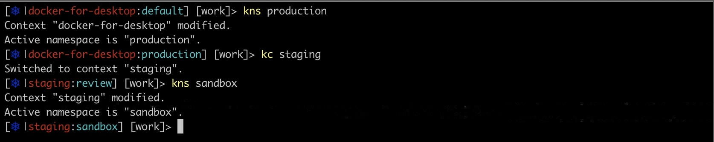

# KubePrompt

KubePrompt is a powershell module that lets you add the current context and namespace in Kubernetes configured in `kubectl` to your PowerShell prompt. The idea for it is based on the [kube-ps1](https://github.com/jonmosco/kube-ps1) project for bash.

## Installation

### Prerequisites

Before installing KubePrompt make sure that [kubectl](https://github.com/kubernetes/kubectl) (kubernetes cli) is installed in the machine and available via the PATH environment variable.

Then install the module from the PowerShell Gallery:

```powershell
> Install-Module -Name KubePrompt
```

## Usage

### Setting your prompt

*KubePrompt* module will detect whether you are using the default prompt or a customized one. If using the default prompt, it is enough to import the module in your PowerShell `$PROFILE`. Otherwise, import *KubePrompt* module and add to your **prompt** function a call to `Write-KubePrompt` as follows:

```powershell
Import-Module -Name KubePrompt

function prompt { 
    Write-KubePrompt
    ... Rest of your prompt
}
```

Then your prompt should looks like:



### Customizing your Kube prompt

* Hides the k8s symbol from the prompt

```powershell
Write-KubePrompt -DisableSymbol
```

* Hides the k8s symbol from the prompt by setting the global KubePromptSettings variable

```powershell
$global:KubePromptSettings.Symbol.Enabled = $false
Write-KubePrompt
```

* Overrides the symbol value with a string

```powershell
Write-KubePrompt -Symbol '*'
```

* Overrides the symbol value through the global KubePromptSettings variable

```powershell
$global:KubePromptSettings.Symbol.Value = '*'
Write-KubePrompt
```

* Overrides the symbol value by passing a Unicode character

```powershell
Write-KubePrompt -Symbol 0x1011 # infinity symbol
```

* Overrides the context string foreground color using a `ConsoleColor` type

```powershell
Write-KubePrompt -ContextColor ([ConsoleColor]::Green)
```

* Overrides the context string foreground color using a string


```powershell
$global:KubePromptSettings.ContextColor = 'Green'
Write-KubePrompt
```

* Overrides the namespace string foreground color using a `ConsoleColor` type

```powershell
Write-KubePrompt -NamespaceColor ([ConsoleColor]::Yellow)
```

* Overrides the namespace string foreground color using a string

```powershell
$global:KubePromptSettings.NamespaceColor = 'Yellow'
Write-KubePrompt
```

## Contributions

We encourage you to contribute to KubePrompt! Please check out the [Contributing](CONTRIBUTING.md) guide for guidelines about how to proceed.

## Changelog

For changes across releases, see [CHANGELOG](CHANGELOG.md)

## License

KubePrompt is released under the [MIT License](License)


